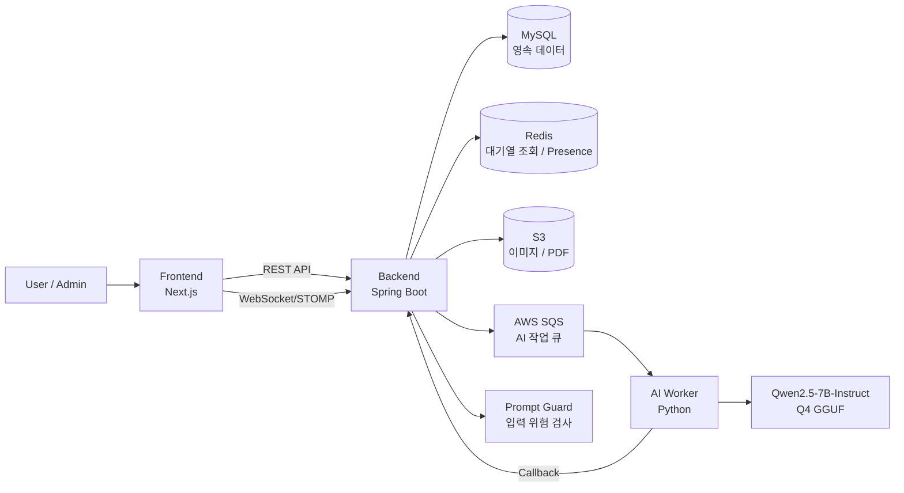
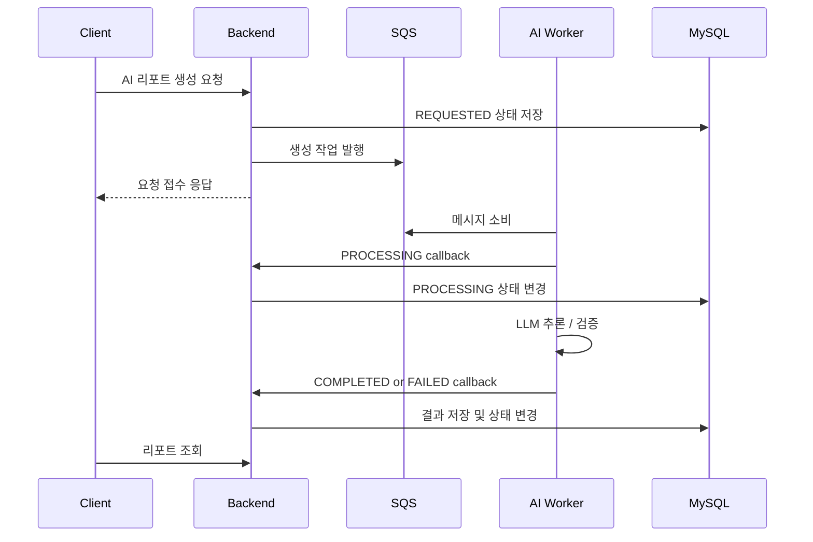

<div align="center">
  <h2>IssueTok</h2>
  <p>
    실시간 사회 이슈를 여러 관점에서 토론하고,<br>
    토론 과정과 결과를 AI 리포트로 다시 확인하는 이슈 기반 토론 플랫폼
  </p>
</div>

<br>

IssueTok은 단순 채팅방이 아니라, 발언권과 의견 작성으로 토론 데이터를 구조화하고 AI 리포트로 재사용 가능한 인사이트를 제공하는 서비스입니다.

<details open>
<summary><strong>목차</strong></summary>

1. [서비스 소개](#서비스-소개)
2. [주요 기능](#주요-기능)
3. [기술 스택](#기술-스택)
4. [시스템 아키텍처](#시스템-아키텍처)
5. [핵심 설계 의사결정](#핵심-설계-의사결정)
6. [성능 테스트](#성능-테스트)
7. [테스트와 품질 관리](#테스트와-품질-관리)
8. [프로젝트 구조](#프로젝트-구조)
9. [실행 방법](#실행-방법)
10. [문서](#문서)
11. [역할 분담](#역할-분담)

</details>

## 서비스 소개

### 배경

실시간 이슈는 빠르게 소비되지만, 사용자는 자신과 비슷한 의견만 반복해서 접하기 쉽습니다.  
기존 커뮤니티는 자유로운 대화에는 적합하지만, 여러 관점을 비교하거나 토론 결과를 다시 정리하는 데는 한계가 있습니다.

IssueTok은 하나의 이슈 안에서 찬성, 반대, 중립 의견이 함께 쌓이고, 토론 과정이 AI 리포트로 정리되는 구조를 제공합니다.

### 핵심 가치

- 다양한 관점의 의견을 한 공간에서 비교
- 발언권 기반으로 토론 흐름과 공식 의견을 분리
- AI 리포트로 토론 결과를 요약, 쟁점, 공통 의견 형태로 재사용
- 관리자 검수와 사용자 제재로 운영 안정성 확보

## 주요 기능

### 사용자 기능

| 기능 | 설명 |
| --- | --- |
| 이슈 기반 토론방 | 실시간 이슈를 기반으로 생성된 토론방 목록 조회 및 참여 |
| 채팅 | 토론방 참여자 간 실시간 대화 |
| 발언권 | 대기열 기반으로 메인 스테이지 발언 순서 제어 |
| 의견 작성 | 찬성, 반대, 중립 입장을 포함한 공식 의견 작성 |
| 공감/신고 | 의견 공감, 채팅/의견 신고 |
| AI 리포트 | 토론 종료 후 기본 리포트 및 커스텀 리포트 확인 |
| PDF 리포트 | 생성된 리포트를 PDF로 다운로드 |

### 관리자 기능

| 기능 | 설명 |
| --- | --- |
| 토픽 후보 검토 | 외부 이슈 수집 결과와 AI 분류 결과 검토 |
| 토픽 생성 | 관리자가 직접 서비스 노출 토픽 생성 |
| 토론방 운영 | 토픽 기반 토론방 생성 및 상태 관리 |
| 신고 처리 | 신고 내역 검토 및 위반 여부 확정 |
| 사용자 제재 | 채팅 제한, 의견/발언권 제한, 계정 정지 적용 |
| 토큰 무효화 | 계정 정지 시 token version 증가로 기존 토큰 차단 |

### AI 기능

| 기능 | 설명 |
| --- | --- |
| 기본 리포트 | 토론 종료 후 전체 요약, 주요 의견, 핵심 쟁점, 공통 의견 생성 |
| 커스텀 리포트 | 사용자 프롬프트 기반 특정 관점 리포트 생성 |
| 토론 중재 | 중간 요약, 반대 쟁점 제시, 논점 이탈 검토 |
| Prompt Guard | 사용자 입력 프롬프트 인젝션 위험 검사 |
| 출력 검증 | JSON Schema 기반 리포트 응답 구조 검증 |

## 기술 스택

| Frontend | Backend | AI | Database | Infra | Monitoring | Test |
|:---:|:---:|:---:|:---:|:---:|:---:|:---:|
| <br><br><br> | <br><br><br><br> | <br><br><br><br> | <br> | <br><br><br><br> | <br><br><br> | <br><br><br> |

## 시스템 아키텍처

### 전체 시스템 구조

<p align="center">

</p>

### 서비스 서버 구조

<p align="center">
</p>

### 요청 흐름 요약



### AI 리포트 생성 흐름



## 핵심 설계 의사결정

### 1. 발언권 동시성 제어

**문제**  
실시간 토론방에서 여러 사용자가 동시에 발언권을 신청하면 순번 충돌, 중복 신청, 중복 배정이 발생할 수 있습니다.

**해결**  
발언권의 실제 상태는 DB 트랜잭션으로 관리하고, 대기열 목록과 내 순번처럼 자주 조회되는 데이터는 Redis Projection으로 분리했습니다.  
발언 종료, 자동 만료, 빈 무대 감지가 동시에 발생해도 락 안에서 현재 발언자 존재 여부를 다시 확인하도록 했습니다.

**결과**  
정합성을 유지하면서 대기열 조회 성능을 개선했고, 다중 방 동시 신청 상황에서도 응답 지연을 줄였습니다.

### 2. WebSocket과 REST 역할 분리

**문제**  
WebSocket 이벤트를 최종 상태 기준으로 사용하면 이벤트 유실이나 재연결 상황에서 화면과 DB 상태가 어긋날 수 있습니다.

**해결**  
REST는 상태 변경과 트랜잭션 결과를 담당하고, WebSocket은 채팅 송수신과 화면 갱신 알림으로 사용했습니다.  
DB 커밋 이후에만 WebSocket 이벤트를 발행해 롤백된 상태가 클라이언트에 노출되는 문제를 막았습니다.

**결과**  
재연결 후 REST 재조회로 상태를 보정할 수 있고, 실시간성과 정합성을 분리해서 관리할 수 있었습니다.

### 3. 토픽 생성과 관리자 검수

**문제**  
실시간 이슈를 자동 수집하더라도 사회 이슈 서비스 특성상 모든 후보를 바로 공개하면 운영 리스크가 큽니다.

**해결**  
Google Trends와 Naver News API를 기반으로 토픽 후보를 만들고 AI가 카테고리를 분류하되, 관리자가 검토한 뒤 토론방으로 연결되도록 했습니다.

**결과**  
자동화로 운영 부담을 줄이면서도 서비스에 노출되는 이슈에 대한 최소한의 검수 단계를 유지했습니다.

### 4. Outbox 기반 외부 연동

**문제**  
AI 리포트 생성, PDF 생성, 이메일 발송, 토큰 삭제처럼 외부 시스템에 의존하는 작업은 트랜잭션 안에서 직접 호출하면 장애 추적과 재시도가 어렵습니다.

**해결**  
상태 변경과 Outbox 이벤트 저장을 같은 DB 트랜잭션 안에서 보장하고, Relay가 이벤트를 외부 시스템으로 발행하도록 분리했습니다.

**적용 대상**

- 방 종료 후 AI 리포트 생성 요청
- 결제 후 커스텀 리포트 생성 요청
- PDF 생성 요청
- 이메일 알림
- 계정 정지 후 Refresh Token 삭제

**결과**  
외부 시스템 장애가 사용자 요청 트랜잭션을 직접 깨뜨리지 않도록 분리했고, 실패 이벤트를 추적하고 재처리할 수 있는 구조를 만들었습니다.

### 5. AI Worker 비동기 분리

**문제**  
LLM 추론은 2분 이상 걸릴 수 있고 GPU 자원을 사용하므로, API 서버에서 동기로 처리하면 요청 스레드 점유와 timeout 문제가 발생할 수 있습니다.

**해결**  
Backend는 요청 상태만 저장하고 SQS로 작업을 발행합니다. AI Worker는 별도 GPU 서버에서 메시지를 소비하고, 처리 결과를 callback API로 전달합니다.

**상태 전이**

```text
REQUESTED -> PROCESSING -> COMPLETED
                         -> FAILED
```

**결과**  
사용자는 긴 HTTP 요청을 기다리지 않고, 서버는 실패 상태와 재시도 가능성을 DB에 남길 수 있습니다.

### 6. 프롬프트 인젝션 방어

**문제**  
커스텀 리포트는 사용자가 직접 프롬프트를 입력하기 때문에 악의적 지시문이 AI Worker까지 전달될 수 있습니다.

**해결**  
Spring Boot에서 Prompt Guard로 1차 검사하고, Python AI Worker에서 입력과 출력을 다시 검사했습니다.

**결과**  
요청 전과 생성 후를 모두 검사하는 다층 방어 구조를 구성했습니다.

## 성능 테스트

### 목표

| 항목 | 목표 |
| --- | --- |
| WebSocket 연결 | 1,000 connections |
| HTTP 처리량 | 500 req/s 이상 |
| HTTP p95 | 500ms 이하 |
| 서버 오류 | 5xx 0% |

### 로컬 목표 혼합 부하 결과

| 항목 | 결과 |
| --- | ---: |
| WebSocket 연결 수 | 1,000 |
| HTTP 처리량 | 634.92 req/s |
| HTTP 실패율 | 0% |
| HTTP p95 | 370.67ms |
| HTTP p99 | 638.69ms |
| WebSocket 실패율 | 0% |

운영 서버는 비용과 안정성을 고려해 smoke, baseline 중심으로 병목 징후를 확인했습니다.

자세한 내용은 [performance/README.md](./performance/README.md), [성능 테스트 결과](./performance/results/2026-06-29-local-target-scale.md)를 참고할 수 있습니다.

## 테스트와 품질 관리

| 항목 | 내용 |
| --- | --- |
| Unit Test | 도메인 규칙과 상태 전이 검증 |
| Controller Test | 인증, 인가, 요청 검증, 응답 포맷 검증 |
| Repository Test | 조회 조건, 페이징, 정렬 검증 |
| WebSocket Test | 설정, 이벤트 발행, 재연결 흐름 검증 |
| AI Report Test | 상태 전이, 실패 케이스, callback 처리 검증 |
| Coverage | JaCoCo 기반 테스트 커버리지 관리 |

## 프로젝트 구조

```text
.
├── backend/          # Spring Boot API 서버
├── frontend/         # Next.js 클라이언트
├── ai_test/          # AI 리포트 서버와 SQS Worker
├── prompt-guard/     # 프롬프트 인젝션 방어 서비스
├── performance/      # k6 성능 테스트 스크립트와 결과
├── monitoring/       # Prometheus, Grafana 설정
├── docs/             # 요구사항, 아키텍처, 테스트 전략, 트러블슈팅 문서
├── db/               # 로컬 MySQL, Redis 데이터 디렉터리
└── docker-compose.yml
```

## 실행 방법

### 1. 인프라 실행

```bash
docker compose up -d mysql redis prompt-guard
```

| 서비스 | 포트 |
| --- | --- |
| MySQL | 23306 |
| Redis | 26379 |
| Prompt Guard | 18080 |

### 2. Backend 실행

```bash
cd backend
./gradlew bootRun
```

로컬 환경 변수 예시:

```bash
DB_HOST=localhost
DB_PORT=23306
DB_NAME=sisibibi
DB_USERNAME=root
DB_PASSWORD=root
REDIS_HOST=localhost
REDIS_PORT=26379
SPRING_PROFILES_ACTIVE=local
```

### 3. Frontend 실행

```bash
cd frontend
npm install
npm run dev
```

### 4. AI 서버 실행

```bash
cd ai_test
python install_dependencies.py
python download_model.py
python run_ai_server.py
```

SQS Worker:

```bash
python run_ai_worker.py
```

## 테스트 실행

### Backend

```bash
cd backend
./gradlew test
./gradlew test jacocoTestReport
```

### Frontend

```bash
cd frontend
npm run lint
npm run e2e
```

### 성능 테스트

```bash
k6 run performance/k6/core-api-mixed.js
```

## 문서

- [문서 지도](./docs/index.md)
- [아키텍처 요약](./ARCHITECTURE.md)
- [요구사항](./docs/product/requirements.md)
- [API 설계](./docs/architecture/api-design.md)
- [API 명세](./docs/architecture/api-spec.md)
- [DB 설계](./docs/architecture/database-design.md)
- [트랜잭션 경계](./docs/architecture/transaction-boundaries.md)
- [보안 기준](./docs/architecture/security.md)
- [테스트 전략](./docs/quality/test-strategy.md)
- [성능 테스트 가이드](./performance/README.md)

## 역할 분담

| 이름 | 역할 |
| --- | --- |
| 장재원 | 팀장, 일정 관리, 성능 테스트, 의견 및 관리자 기능 |
| 강승규 | 발언권 대기열, 대기열 정합성 및 성능테스트 |
| 백채현 | WebSocket, 채팅 |
| 이현태 | 배포 설계 및 CI/CD, 토론방, 토픽, Outbox, 결제 |
| 김한솔 | AI 리포트, 모델링, AI Worker |

## 프로젝트 의의

IssueTok은 의견이 흘러가고 사라지는 공간을 발언권, 중재, 리포트로 구조화해 다시 활용 가능한 토론 데이터로 바꾸는 서비스입니다.

이번 프로젝트에서는 실시간 토론 서비스가 가져야 할 정합성, 응답성, 운영 안정성을 발언권 동시성 제어, WebSocket 상태 동기화, Outbox, AI 비동기 처리, 성능 테스트로 검증했습니다.
